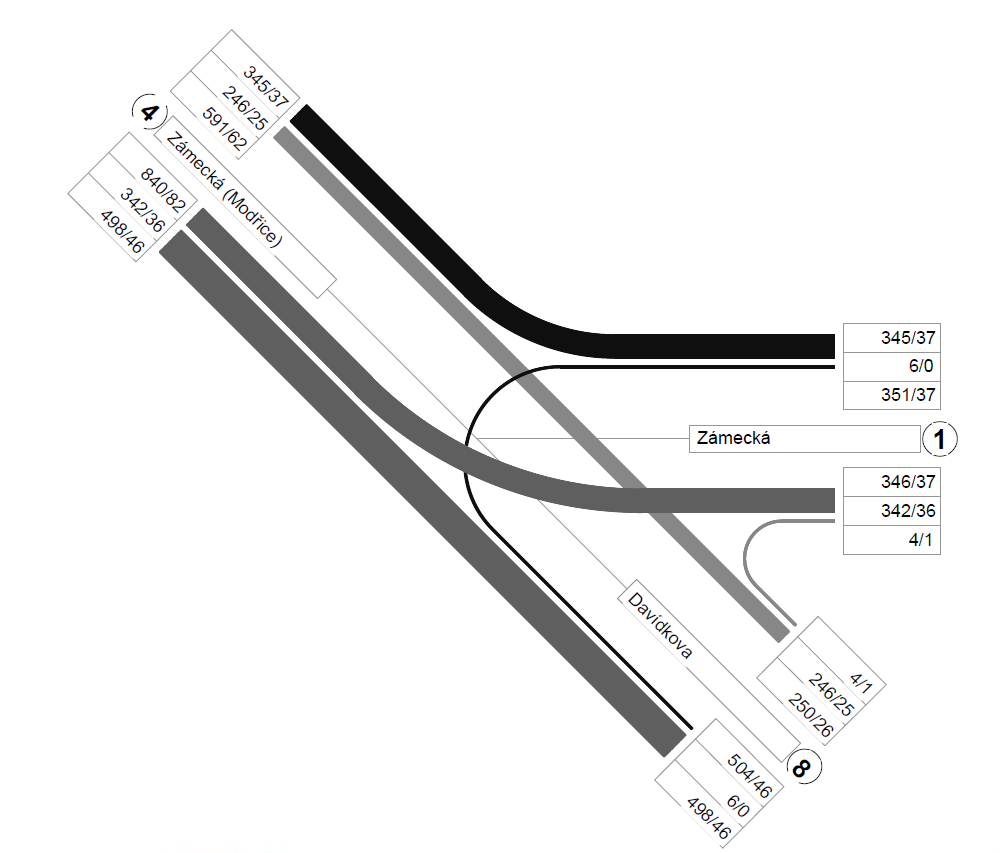

# capacity_calculation

Linux / macOS:

`python3 capacity_unregulated_t_shape.py --i2 396 --i3 567 --i4 284 --i6 6 --i7 6 --i8 401`

Windows:

`python capacity_unregulated_t_shape.py --i2 396 --i3 567 --i4 284 --i6 6 --i7 6 --i8 401`
